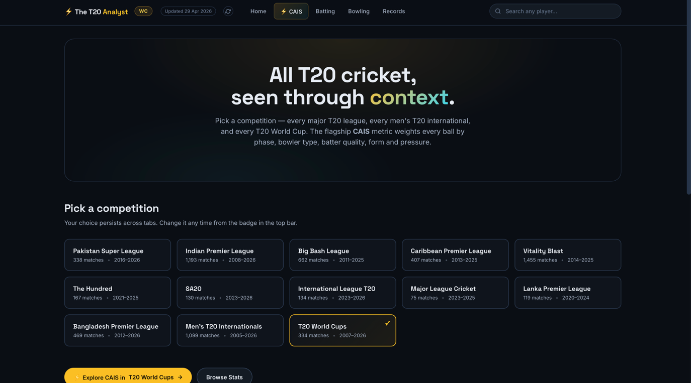
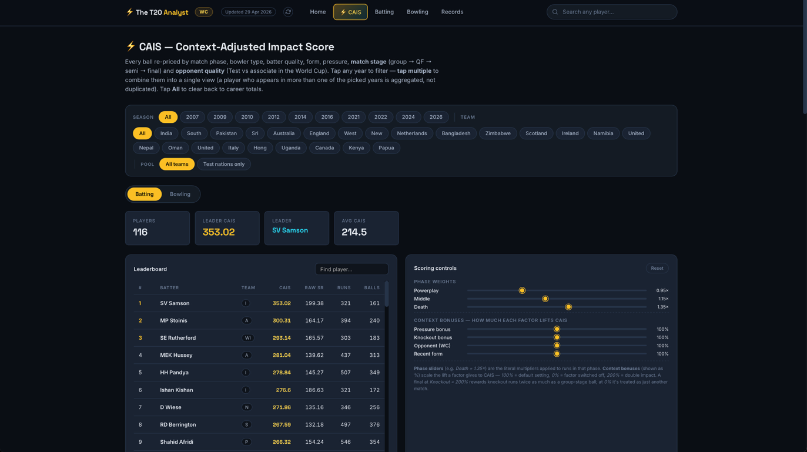

# The T20 Analyst

**Ball-by-ball analytics across every major T20 competition, fronted by CAIS —
a context-adjusted impact score that re-prices every delivery.**

**Live site: [mustafa-os.github.io/T20-CricketAnalytics](https://mustafa-os.github.io/T20-CricketAnalytics/)**



13 competitions. 6,300+ matches. ~1.8 million deliveries. One lens that refuses
to let a death-over six against an elite attack count the same as a middle-over
single off the fifth bowler in a dead game.

---

## What it does

Conventional batting and bowling tables flatten the thing that actually matters
in T20: **context**. A strike rate of 140 is average in the powerplay and elite
at the death. A 30-run spell is cheap in the 18th over and expensive in the
middle. A four-for against Sri Lanka and Namibia at a World Cup is not a
four-for against Sri Lanka and India.

The T20 Analyst scores every delivery *with context attached* — phase of the
innings, batter quality, bowler type, match pressure, tournament stage,
opponent quality — and rolls leaderboards up from there. The result is an
ordering that reflects the quality of what happened, not just the volume.

### Competitions (13)

| Code     | Competition                      |
| -------- | -------------------------------- |
| `psl`    | Pakistan Super League            |
| `ipl`    | Indian Premier League            |
| `bbl`    | Big Bash League                  |
| `cpl`    | Caribbean Premier League         |
| `ntb`    | Vitality Blast                   |
| `hnd`    | The Hundred                      |
| `sa20`   | SA20                             |
| `ilt`    | International League T20         |
| `mlc`    | Major League Cricket             |
| `lpl`    | Lanka Premier League             |
| `bpl`    | Bangladesh Premier League        |
| `t20is`  | Men's T20 Internationals *(Full Members only)* |
| `wc`     | T20 World Cups                   |

The T20I view is filtered to the 12 ICC Full Members so leaderboards reflect
first-tier opposition, not tier-6 warm-up fixtures.

### Five views per competition

1. **CAIS** — batting and bowling leaderboards with the context-adjusted score,
   a bar chart of the top 20, a CAIS-vs-raw-SR scatter, season and team
   filters, and a live scoring-control panel. The flagship view.
2. **Batting** — runs, average, strike rate, and an average-vs-SR bubble plot.
3. **Bowling** — wickets, economy, and a wickets-vs-economy scatter.
4. **Records** — highest scores, century makers, team win-rates, dismissal
   breakdowns.
5. **Player profile modal** — career stats, per-season trends, innings history,
   and the player's CAIS rank within the current competition. Opens from any
   name in any leaderboard.

---

## CAIS — Context-Adjusted Impact Score



Every legal delivery is re-priced before it lands on the scorecard. The weights
live in `CricketAnalyser.py` (see `_build_enriched`); the gist:

### Batting

    CAIS = Σ (runs × phase × pressure × stage × opponent) / balls × 100 × form

| factor        | value                                     |
| ------------- | ----------------------------------------- |
| phase         | 0.95 powerplay · 1.15 middle · 1.35 death |
| pressure      | 1.0 → 1.5, combining wickets-lost and 2nd-innings required rate |
| stage         | 1.00 group · 1.10 QF · 1.20 SF · 1.30 final (tournaments only) |
| opponent      | WC only: 1.20 associate-vs-Test, 0.85 Test-vs-associate |
| form          | rolling-5 innings ratio vs the field mean, clipped 1.0–1.45 |

The phase weight is **flipped** on purpose — strike rate in the powerplay is
inflated by fielding restrictions, death bowlers aim at your toes. A 20-ball
30 at the death is genuinely harder than a 20-ball 30 in the first six.

### Bowling

    wicket_value = 30 × (phase × role) × batter_tier × form × pressure
                      × partnership × early_wicket × stage × opponent
    run_cost     = runs_conceded × phase_bowl_weight × 0.5 × stage × opponent
    CAIS         = Σ (is_wicket × wicket_value − run_cost) / overs

| factor            | value                                                     |
| ----------------- | --------------------------------------------------------- |
| phase × role      | pace: 2.0 / 1.2 / 1.8 · spin: 1.5 / 1.5 / 1.2 (PP/mid/death) |
| batter_tier       | derived per competition from runs + SR percentile         |
| form              | per-batter rolling form at the time of the wicket         |
| pressure          | same wicket + chase pressure as batting                   |
| partnership       | 1.0 at 20-run stand, ramps to 1.6 at 70+                  |
| early_wicket      | 1.35 in first over, 1.15 in overs 2–3, 1.0 otherwise      |
| stage             | same group/QF/SF/final ladder as batting                  |
| opponent          | WC only: 1.20 associate-vs-Test, 0.85 Test-vs-associate   |
| phase_bowl_weight | 1.2 powerplay · 1.0 middle · 1.3 death (run cost only)    |

A pace powerplay wicket that breaks a 60-run stand against an elite batter in
a high-RRR chase can score **5–6× more** than a tailender in a dead middle
over. That's the whole point.

### Stage multiplier

Cricsheet's CSV schema stores `match_number` as plain integers even for finals,
so the stage is inferred from match dates: within each (competition, season)
the latest match is the Final (1.30), the 1–3 matches within 7 days of it are
the Semis / Qualifiers (1.20), and the 4–5 matches within 10 days are
Quarters / Eliminators (1.10). Everything else is group stage (1.00).
Bilateral T20Is are excluded from the stage ladder — the last match of a
calendar year is not a "final" in any meaningful sense.

### Opponent-quality multiplier

Only applies inside the T20 World Cup, where the main draw mixes Full Members
and qualified associates: a Test-nation player gets less credit (0.85) for
runs or wickets against associate opposition, and an associate player gets
more (1.20) against Test-nation opposition. Everywhere else it stays at 1.00.
A **Pool** chip in the WC view further restricts the leaderboard to the 12
Test nations for apples-to-apples comparisons.

### Scoring controls

The CAIS page exposes the phase weights and context bonuses as live sliders —
set a bonus to 0% to switch that factor off, 200% to double it, and the
leaderboard re-ranks client-side without recomputing anything server-side.

---

## How it works

### Two delivery modes, one page

- **Static GitHub Pages** (the public deployment) — precomputed
  per-competition JSON under `static/data/`, served as plain files. No
  backend, no pandas, sub-100 ms competition switching.
- **Flask dev server** (local) — dynamic, reads the full ball-by-ball frame,
  recomputes on demand.

The same `index.html` handles both: it hits `/api/...` first when running
under Flask and falls back to `static/data/<comp>/<file>.json` otherwise.

### Pipeline

    Cricsheet zips ──ingest.py──▶ data/*.csv ──CricketAnalyser──▶ enriched frame
                                                     │
                                       precompute.py ▼
                                       static/data/<comp>/*.json ──▶ GitHub Pages

- `ingest.py` downloads Cricsheet's per-competition ball-by-ball zips,
  normalises them into one CSV schema, derives the World Cup slice from T20I
  events, and filters T20Is to Full Members.
- `CricketAnalyser.py` (~1,100 lines of pandas/NumPy) enriches every delivery
  with phase, pressure, partnership state, stage and opponent multipliers,
  batter tiers, bowler roles and rolling form, then aggregates CAIS and every
  other view. Vectorised throughout.
- `precompute.py` bakes the whole thing into a per-competition folder of
  career and per-season JSON (one file per view per season) plus a
  `competitions.json` manifest carrying the freshness timestamp shown in the
  site header.
- `audit.py` cross-checks the computed leaderboards against hard-coded
  reference values (IPL Orange/Purple Caps, PSL season leaders, T20 WC top
  scorers) and, in `--strict` mode, fails the pipeline before anything is
  published if a number drifts out of tolerance.

### Automation

Two GitHub Actions workflows keep the public site current without manual
intervention:

- **Nightly refresh** (`refresh.yml`) — re-ingests every Cricsheet zip,
  rebuilds the static JSON bundle, runs the audit gate, and commits the
  result (`chore(data): nightly refresh`).
- **Pages deploy** (`pages.yml`) — republishes the static site whenever
  `index.html` or `static/**` changes on `main`.

### Performance

The first version was visibly sluggish across ~2 M rows — full CSV parse on
every request, full `groupby` scan on every league switch. The current hot
path:

1. **Parquet sidecar cache** — `read_parquet` is ~5× faster than `read_csv`
   on this dataset. Built on first boot, reused every run after.
2. **Per-competition memoisation** — enrichment, batter tiers, form scores
   and bowler roles are each cached per competition, so switching leagues
   slices ~70k–300k rows once and reuses everything after.
3. **Static mode** — every public view reads a 10–200 KB JSON. No server, no
   pandas, no runtime cost.

Measured on an M2 laptop with a warm parquet cache: app boot ~2.8 s, first
CAIS build for a competition ~0.35–1.6 s, repeat views ~0.14 s, any static
JSON fetch <50 ms.

---

## Getting started

The zero-setup option is the [live site](https://mustafa-os.github.io/T20-CricketAnalytics/).
To run locally:

```bash
pip install -r requirements.txt   # pandas, numpy, flask
pip install pyarrow               # optional — enables the faster parquet cache

# 1. Pull ball-by-ball data from Cricsheet (data/ is not committed)
python ingest.py                  # every league
python ingest.py ipl psl          # or just the ones you want

# 2. Run the Flask app
python app.py                     # http://localhost:5000
```

To regenerate the static bundle that GitHub Pages serves:

```bash
python precompute.py              # every competition (~10 min)
python precompute.py ipl psl wc   # just the named ones
```

> **Gotcha:** running `precompute.py` with specific codes overwrites
> `static/data/competitions.json` with a manifest covering only those codes.
> Restore it with `git checkout HEAD -- static/data/competitions.json`.

---

## Project layout

    .
    ├── index.html               # Single-page UI (Plotly + vanilla JS). Dual-mode.
    ├── app.py                   # Flask backend — /api routes for dynamic mode.
    ├── CricketAnalyser.py       # Analytics engine. Enrichment + CAIS v3.
    ├── ingest.py                # Cricsheet zips → project CSV schema.
    ├── precompute.py            # Bakes every static/data/<comp>/*.json file.
    ├── audit.py                 # Leaderboard accuracy gate vs reference values.
    ├── CAIS_Methodology.docx    # Longer methodology write-up.
    ├── .github/workflows/       # Nightly data refresh + Pages deploy.
    ├── data/                    # (gitignored) raw zips, CSVs, parquet cache.
    └── static/data/             # Precomputed JSON — manifest + ~15 files per comp.

---

## Notable design choices

- **`match_id` collision guard.** WC matches also appear inside the raw T20I
  frame under the same `match_id`, so the stage-multiplier map is keyed on
  `(competition, match_id)` — knockout bumps from the World Cup can't leak
  into a bilateral view.
- **Every aggregated row carries a balls-weighted `team` field**, which powers
  the client-side team chip and the WC Pool filter without an extra
  round-trip.
- **Multi-season merge.** Selecting several seasons fetches each season's JSON
  and combines them per player with an endpoint-specific merger
  (balls-weighted CAIS, additive runs/wickets, weighted SR/economy) — a
  player who appears in three seasons shows once, aggregated.
- **Accuracy audited, not assumed.** The nightly pipeline refuses to publish
  if computed leaderboards drift from published reference values.

---

## Project context

Personal project, built from April 2026 onwards and still running nightly.
Started as a PSL-only dashboard and grew into a full multi-competition
platform with its own metric, static-site compiler and automated data
pipeline. All ball-by-ball data is from [Cricsheet](https://cricsheet.org/);
CAIS, the enrichment pipeline, the UI and every line of analysis code are
original to this project.

Code is MIT-licensed (see [LICENSE](LICENSE)); the data remains subject to
[Cricsheet's terms](https://cricsheet.org/register/).

---

Built by Mustafa Suleman — MEng Design Engineering, Imperial College London · [LinkedIn](https://www.linkedin.com/in/mustafaosuleman/)
